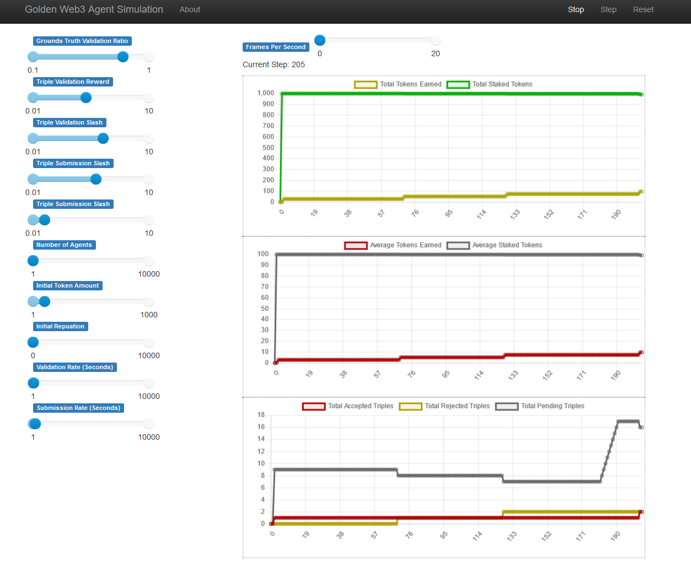

# Simulation for Golden's Protocol

## Overview

[Golden's protocol](https://golden.xyz/) provides users with the opportunity to query from and contribute towards building the world's most extensive decentralized graph of canonical knowledge.

Our simulation helps us test and model the mechanics of the protocol. This provides us with accelerated insight on various behaviors and patterns that will emerge from usage of the protocol.

The simulation is built with with [Mesa](https://github.com/projectmesa/mesa)

## Quick Start

### 1. Docker

Currently, using docker is the best way to get started with the simulation.

Build and run with docker-compose:

Run `docker-compose build` to build the simulation image.

Then run `docker-compose up` if to deploy the simulation jupyter notebook and the visualization server.

### 2. Mesa's Visualization Server

Go to `localhost:8521` for the interactive and visual sim server.

You can visualize some components of Golden's validation and tokenomics in a timeline in the server.

Note that you can adjust various simulation variables on the side bar. However the iteration speed is
quite slow.

### 3. Jupyter Server

Go to `localhost:8888` for the notebook server and playground notebooks.

You can explore the `notebooks/` directory in this repository in this jupyter lab server.

Simulation iterations occur much faster here.

## Contact

For all things related to the simulation and development, please contact the maintainer Andrew Chang at andrew@golden.co or [@achang1618](https://twitter.com/achang1618) for any quesions or comments.

For all other support, please reach out to support@golden.co.

Follow [@golden](https://twitter.com/Golden) to keep up with additional news!

## License

This project is licensed under the terms of the Apache 2.0 license